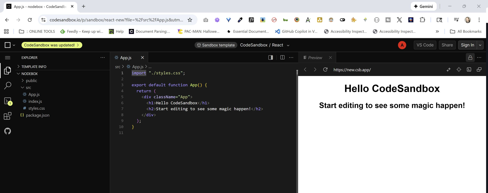

<!-- 🔗 Custom Stylesheet -->
<link rel="stylesheet" href="../../_css/main.css">


<!-- 🖼️ Site Logo -->


<!-- 📝 Title -->
# 📒 COURSE NOTES: <span class="course-title">[The Ultimate React Course 2025: React, Next.js, Redux & More](https://www.udemy.com/course/the-ultimate-react-course/?couponCode=MT251107G2)</span>


## 📂 Chapter 01: **Intro & Setup**


* **Chapter URL:** [https://www.udemy.com/course/the-ultimate-react-course/?couponCode=MT251107G2](https://www.udemy.com/course/the-ultimate-react-course/?couponCode=MT251107G2)
* **Course Starter Files:** [https://github.com/jonasschmedtmann/react-course](https://github.com/jonasschmedtmann/react-course) (GitHub repo with starter/final code)[web:16]


<!-- 🧭 Navigation -->
### [🏚️ README](../../README.md) | [📁 Index](index.md) | [🔖 Bookmark](#bookmark)


<br>


**In this Folder:**


<section class="ehw-doc-descr">


These are my personal notes on **Chapter 1: Intro & Setup** from the Ultimate React Course by Jonas Schmedtmann. This chapter covers the initial orientation for the course, what React is and why it's important for building scalable web applications, and the recommended setup steps for following along.

Key tasks include downloading **starter code and final projects** from the official GitHub repository, installing **Node.js**, setting up **VS Code**, initializing a React project using *Create React App* or *Vite*, and reviewing the structure of course materials.

Core concepts introduced:
- The purpose and benefits of **React**
- How React compares to vanilla JavaScript
- Project folder setup and coding along
- Importance of hands-on coding vs passive watching
- Advice for pacing and progressing in the course

Real-world applications highlighted include building **dynamic websites**, **SaaS dashboards**, and **mobile-ready UIs** using React and industry tools such as **Redux**, **Tailwind**, and **React Query**[web:17][web:16].


</section>


<!-- 🏷️ RELATED TAGS -->
<section id="sec-tags">


## 🏷️ Tags:


- React
- Course Setup
- Web Development
- Project Starter
- VS Code
- Node.js
- JavaScript
- GitHub


</section>


---


<!-- 📖 TOC (Table of Content) -->
<details open>


<summary>Table of Contents</summary>


- [📒 COURSE NOTES: The Ultimate React Course 2025: React, Next.js, Redux \& More](#-course-notes-the-ultimate-react-course-2025-react-nextjs-redux--more)
  - [📂 Chapter 01: **Intro \& Setup**](#-chapter-01-intro--setup)
    - [🏚️ README | 📁 Index | 🔖 Bookmark](#️-readme---index---bookmark)
  - [🏷️ Tags:](#️-tags)
  - [▶️ VID 1: Course Roadmap \& Projects](#️-vid-1-course-roadmap--projects)
  - [Course Organization:](#course-organization)
  - [▶️ VID 2: Building Our First React App](#️-vid-2-building-our-first-react-app)
  - [Bookmark: Stopped Ch 1.02 @@2:50 (11/12/2025)](#bookmark-stopped-ch-102-250-11122025)


</details>
<!-- Lesson Notes -->

***

## ▶️ VID 1: Course Roadmap & Projects


## Course Organization:
- **Part 01**: Fundamentals - Build small but nice projects (components, JSX, props, state, forms). Tons of challenges and excercise
- **Part 02**: Intermediate - data fetching, hooks, custom hooks, React behind the scene
- **Part 03**: Advanced - Reducers, performance optimizations, react router, redux/toolkit
- **Part 04**: Professional Dev - Build 2 pro real-world apps using redux tailwind react query supabase, etc.

Focus: Modern front-end dev with React - updated May 2025


## ▶️ VID 2: Building Our First React App

Code Sandbox.io:
- https://codesandbox.io/p/sandbox/react-first-app-advice-52879f?file=%2Fsrc%2FApp.js

> 💡 **TIP**: *Generate a codesandbox.io new React app boilerplate by navigating to `react.new`*



- Based on **VSCODE**

<br>

<section class="assignment-answer-sec">

**✍️ PROJECT STARTING CODE:**

<span class="code-filename">App.js</span>

```jsx
import "./styles.css";

export default function App() {
  return (
    <div className="App">
      <h1>Hello CodeSandbox</h1>
      <h2>Start editing to see some magic happen!</h2>
    </div>
  );
}
```

</section><!-- END .assignment-answer-sec -->

<br>

Delete the style.css file and clear the App.js file to start from scratch

> 💡 **TIP**: *A `component` in React is really just a function*


## Bookmark: Stopped Ch 1.02 @@2:50 (11/12/2025)


<!-- END Lesson Notes -->