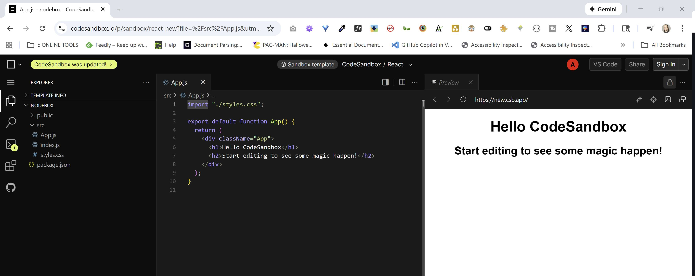

<!-- 🔗 Custom Stylesheet -->
<link rel="stylesheet" href="../../_css/main.css">


<!-- 🖼️ Site Logo -->


<!-- 📝 Title -->
# 📒 COURSE NOTES: <span class="course-title">[The Ultimate React Course 2025: React, Next.js, Redux & More](https://www.udemy.com/course/the-ultimate-react-course/?couponCode=MT251107G2)</span>


## 📂 Section 01: **Intro & Setup**


* **Section URL:** [https://www.udemy.com/course/the-ultimate-react-course/?couponCode=MT251107G2](https://www.udemy.com/course/the-ultimate-react-course/?couponCode=MT251107G2)
* **Course Starter Files:** [https://github.com/jonasschmedtmann/react-course](https://github.com/jonasschmedtmann/react-course) (GitHub repo with starter/final code)[web:16]


<!-- 🧭 Navigation -->
### [🏚️ README](../../README.md) | [📁 Index](index.md) | [🔖 Bookmark](#bookmark)


<br>


**In this Folder:**


<section class="ehw-doc-descr">


These are my personal notes on **Section 1: Intro & Setup** from the Ultimate React Course by Jonas Schmedtmann. This section covers the initial orientation for the course, what React is and why it's important for building scalable web applications, and the recommended setup steps for following along.

Key tasks include downloading **starter code and final projects** from the official GitHub repository, installing **Node.js**, setting up **VS Code**, initializing a React project using *Create React App* or *Vite*, and reviewing the structure of course materials.

Core concepts introduced:
- The purpose and benefits of **React**
- How React compares to vanilla JavaScript
- Project folder setup and coding along
- Importance of hands-on coding vs passive watching
- Advice for pacing and progressing in the course

Real-world applications highlighted include building **dynamic websites**, **SaaS dashboards**, and **mobile-ready UIs** using React and industry tools such as **Redux**, **Tailwind**, and **React Query**[web:17][web:16].


</section>


<!-- 🏷️ RELATED TAGS -->
<section id="sec-tags">


## 🏷️ Tags:


- React
- Course Setup
- Web Development
- Project Starter
- VS Code
- Node.js
- JavaScript
- GitHub


</section>


---


<!-- 📖 TOC (Table of Content) -->
<details open>


<summary>Table of Contents</summary>


- [📒 COURSE NOTES: The Ultimate React Course 2025: React, Next.js, Redux \& More](#-course-notes-the-ultimate-react-course-2025-react-nextjs-redux--more)
  - [📂 Section 01: **Intro \& Setup**](#-section-01-intro--setup)
    - [🏚️ README | 📁 Index | 🔖 Bookmark](#️-readme---index---bookmark)
  - [🏷️ Tags:](#️-tags)
  - [▶️ VID 1: Course Roadmap \& Projects](#️-vid-1-course-roadmap--projects)
  - [Course Organization:](#course-organization)
  - [▶️ VID 2: Building Our First React App](#️-vid-2-building-our-first-react-app)
  - [▶️ VID 3:  Watch Before You Start!](#️-vid-3--watch-before-you-start)
  - [▶️ VID 4:  Read Before You Start:](#️-vid-4--read-before-you-start)
      - [**1️⃣ Download starter code**](#1️⃣-download-starter-code)
      - [**2️⃣ Download course slides**](#2️⃣-download-course-slides)
      - [**3️⃣ Community \& resources**](#3️⃣-community--resources)
  - [▶️ VID 5:  Downloading Course Material](#️-vid-5--downloading-course-material)


</details>
<!-- Lesson Notes -->

***

## ▶️ VID 1: Course Roadmap & Projects


## Course Organization:
- **Part 01**: Fundamentals - Build small but nice projects (components, JSX, props, state, forms). Tons of challenges and excercise
- **Part 02**: Intermediate - data fetching, hooks, custom hooks, React behind the scene
- **Part 03**: Advanced - Reducers, performance optimizations, react router, redux/toolkit
- **Part 04**: Professional Dev - Build 2 pro real-world apps using redux tailwind react query supabase, etc.

Focus: Modern front-end dev with React - updated May 2025


## ▶️ VID 2: Building Our First React App

Code Sandbox.io:
- https://codesandbox.io/p/sandbox/react-first-app-advice-52879f?file=%2Fsrc%2FApp.js

> 💡 **TIP**: *Generate a codesandbox.io new React app boilerplate by navigating to `react.new`*



- Based on **VSCODE**

<br>

<section class="assignment-answer-sec">

**✍️ PROJECT STARTING CODE:**

<span class="code-filename">App.js</span>

```jsx
import "./styles.css";

export default function App() {
  return (
    <div className="App">
      <h1>Hello CodeSandbox</h1>
      <h2>Start editing to see some magic happen!</h2>
    </div>
  );
}
```

**✍️ MY ANSWER:**

```py
import { useEffect, useState } from "react";

export default function App() {
  const [advice, setAdvice] = useState("");
  const [count, setCount] = useState(0);

  async function getAdvice() {
    const res = await fetch("https://api.adviceslip.com/advice");
    const data = await res.json();
    setAdvice(data.slip.advice);
    setCount((c) => c + 1);
  }

  useEffect(function () {
    getAdvice();
  }, []);

  return (
    <div>
      <h1>{advice}</h1>
      <button onClick={getAdvice}>Get advice</button>
      <Message count={count} />
    </div>
  );
}

function Message(props) {
  return (
    <p>
      You have read <strong>{props.count}</strong> pieces of advice
    </p>
  );
}
```

</section><!-- END .assignment-answer-sec -->

<br>

Delete the style.css file and clear the App.js file to start from scratch

> 💡 **TIP**: *A `component` in React is really just a function*


## ▶️ VID 3:  Watch Before You Start!


- Course designed for all experience levels
- You can skip `optional` sections
- Code along with him &mdash; you learn ZERO React skills by just watching him
- Don't worry about React mechanics and best practices while learning fundamentals
- We just want code that works at this point
- If you can't solve a problem, check the QA section, and if that doesn't help, add your own question and share a codesandbox.io link
- Make sure you understand the previous section because each section builds on the previous
- He designed the course to work on Windows, MacOS, and Linux
- Always have fun while coding


## ▶️ VID 4:  Read Before You Start:


#### **1️⃣ Download starter code**

Before starting the course, please download the starter files and final code from the GitHub repo below

**_🚨 Please read the FAQ on GitHub! Believe me, you will ask some of these questions eventually 😉_**

👉 [Starter and final code and FAQs on GitHub](https://github.com/jonasschmedtmann/ultimate-react-course)

  

#### **2️⃣ Download course slides**

You can also download the [***course slides***](docs/theory-slides-v1.1.pdf) from the end of this lecture (`theory-slides.pdf`) 👇  
They will be helpful to review all important React concepts.

  

#### **3️⃣ Community & resources**

👉 We have a very friendly **student community on Discord with 75,000+ students**. This is where you learn together with other students just like you, and get **updates on new courses**. Join [by clicking here](https://discord.gg/uhMkpf4)!

👉 Also check out [my resources page](https://jonas.io/resources/) (it contains design and development assets, tools, and resources)

👋 **Pro tip:** Don't use lecture numbers when taking notes, because they will change each time I update something in the course.

  

**And now, have a lot of fun with the course! 😁**


## ▶️ VID 5:  Downloading Course Material

Before starting part 1, you need to download the [**course starter files and final project folders from Github**](https://github.com/jonasschmedtmann/ultimate-react-course).

- Click green button on GitHub and download as a ZIP file

- Theres one folder for each project.
- If you find a bug in your code, best thing to do is compare to the final files

- **Updates and fixes:** Updates to the code added after the course was published can be found in [this branch](https://github.com/jonasschmedtmann/ultimate-react-course/tree/updates-and-fixes)


<!-- END Lesson Notes -->