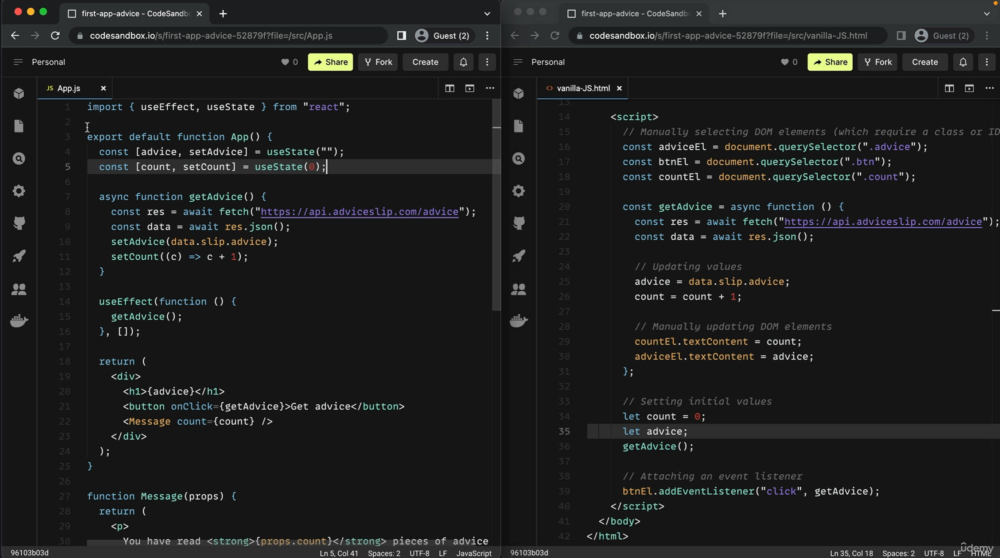

<!-- 🔗 Custom Stylesheet -->
<link rel="stylesheet" href="../../_css/main.css">


<!-- 🖼️ Site Logo -->


<!-- 📝 Title -->
# 📒 COURSE NOTES: <span class="course-title">[The Ultimate React Course 2025: React, Next.js, Redux & More](https://www.udemy.com/course/the-ultimate-react-course/?couponCode=MT251107G2)</span>


## 📂 Section 03: **A First Look at React**


* **Section URL:** https://www.udemy.com/course/the-ultimate-react-course/learn/lecture/37350384#overview


<!-- 🧭 Navigation -->
### [🏚️ README](../../README.md) | [📁 Index](index.md) | [🔖 Bookmark](#bookmark)


<br>


**In this Folder:**


<section class="ehw-doc-descr">


These are my personal notes on **Section 3: A First Look at React** ...


</section>


<!-- 🏷️ RELATED TAGS -->
<section id="sec-tags">


## 🏷️ Tags:


- React
- JSX
- Components
- Props
- State
- Functional Components
- useState Hook
- Virtual DOM


</section>


---


<!-- 📖 TOC (Table of Content) -->
<details open>


<summary>Table of Contents</summary>


- [📒 COURSE NOTES: The Ultimate React Course 2025: React, Next.js, Redux \& More](#-course-notes-the-ultimate-react-course-2025-react-nextjs-redux--more)
  - [📂 Section 03: **A First Look at React**](#-section-03-a-first-look-at-react)
    - [🏚️ README | 📁 Index | 🔖 Bookmark](#️-readme---index---bookmark)
  - [🏷️ Tags:](#️-tags)
  - [▶️ VID 9:  Why Do Front-End Frameworks Exist?](#️-vid-9--why-do-front-end-frameworks-exist)
    - [Problems using Vanilla JavaScript to Build Front-End Applications](#problems-using-vanilla-javascript-to-build-front-end-applications)
      - [Problems with JS jQuery](#problems-with-js-jquery)
  - [▶️ VID 10: React vs. Vanilla JavaScript](#️-vid-10-react-vs-vanilla-javascript)
      - [@@ 00:00:28](#-000028)
  - [▶️ VID 11: What is React?](#️-vid-11-what-is-react)
  - [▶️ VID 12: Setting Up Our Development Environment](#️-vid-12-setting-up-our-development-environment)
      - [@@ 00:04:00](#-000400)
      - [@@ 00:06:19 - Setup Snippets](#-000619---setup-snippets)
  - [▶️ VID 13: Pure React](#️-vid-13-pure-react)
      - [@@ 00:9:40 - Working 'Pure React' Hello World! app:](#-00940---working-pure-react-hello-world-app)
      - [@@ 00:14:00 Working CLOCK coded only with pure React:](#-001400-working-clock-coded-only-with-pure-react)
  - [▶️ VID 14: A Quick Look at React's Official Documentation](#️-vid-14-a-quick-look-at-reacts-official-documentation)
  - [▶️ VID 15: Setting Up a New React Project: The Options](#️-vid-15-setting-up-a-new-react-project-the-options)
  - [▶️ VID 16: Setting Up a Project With Create-React-App](#️-vid-16-setting-up-a-project-with-create-react-app)


</details>
<!-- Lesson Notes -->

***

## ▶️ VID 9:  Why Do Front-End Frameworks Exist?

**Server-Side Rendering**

- Before 2010-ish, all websites were always rendered on the server
- Webiste is assmbled on the backend based on data and templates
- Resulting HTML/CSS/JavaScript then sends to website browser
- Browser then paints the site on the screen
- Ex: **WordPress**

- JavaScript used to only add simple animations, hover effects, etc.
- jQuery grew popular because it made JS work the same in all browsers
- Over time, devs wrote more and more JS code to be executed by the browser, which led to the rise of SPA (single-page applications)
- SPA: Webpages rendered on the client, not on the server

**Client-Side Rendering**

- Rendering the webpage shifted from server to the client
- These websites are called **web applications**
  
- web applications usually get data not from database, but from API
- app consumes api data and renders a screen for each view of the application
- feel like native desktop / phone app
- can click links / submit forms without the page ever reloading
- you are always on the same page, hence the name single page app


**NOTE:** Server side rendering is slowly getting popular again driven by **NextJS**, **Remix**, etc.


### Problems using Vanilla JavaScript to Build Front-End Applications


- Building front end applications receive data, changes the data as the user uses the app, always displays current data on the screen
- Most important task of any web application: ensure UI always displays **current state** of the data

**#GOTCHA:** Ensure state synchronization is a really hard problem to solve!


- **EX:** AirBnB

- Without a framework it would be super-hard to keep the data in-sync


#### Problems with JS jQuery


- Building a complex frontend with vanilla JS alone requires a large amount of direct DOM traversing and manipulation (class toggling, etc.)

- Results in entangled compex **"spaghetti code**

- Data is usually stored in the DOM (in hidden fields) shared across entire app; hard to reason, bugs


- Hard to understand and will introduce many bugs into the application

- If you try to solve the problems on your own you'll just end up creating your own framework, one way inferior to established frameworks like React.

- JS front-end frameworks exist because: keeping front-end interterfaces in-sync with data is really hard and a lot of work

- Front-end frameworks (like Angular, React, Vue) solve this problem so devs can focus only on the data and building user interfaces

- Frameworks enforce a correct way of structuring and writing code


## ▶️ VID 10: React vs. Vanilla JavaScript

https://www.udemy.com/course/the-ultimate-react-course/learn/lecture/37350394

- To get an first-feeling for how react keeps UI in sync with state, we compare the advice app fro the 1st sec with a vanilla JS implementation of the same application

#### @@ 00:00:28




---

**STARTING CODESANDBOX LINK FOR THIS CHAPTER:** https://codesandbox.io/p/sandbox/react-first-app-advice-52879f


**Comparison Notes:**
- In React we use JS and JSX to build HTML, but in vanilla JS we include JS scripts into an HTML boilerplate framework
- In React no need to target classes unnecessarily
- In React no event listener needed manually (its more automatic)?
- React automatically updates the UI to keep data in-sync, but in JS you have to manually update textContent values


> 📌 **Tip:** The **_main value_** of React over vanilla JS is that it does a better job of automatically keeping the data in-sync with the user interface.


## ▶️ VID 11: What is React?


https://www.udemy.com/course/the-ultimate-react-course/learn/lecture/37350396

- **Official React definition:** a JavaScript library for building user interfaces
- **Unofficial modified definition:** extremely popular, declarative, component-based, state-driven JavaScript library for building user interfaces, created by Facebook

**Deconstructing the Deifinition:**
- Components are building blocks of user interfaces in React
- React draws components on a webpage
- Ex: AirBnB: Navbar, searchbar, results panel, map, listing
- we describe how components look and how they work using a **declarative syntax called JSX**
- **declarative:** we tell React what a component should look like on the current state
- React is **abstractiion** away from DOM: WE NEVER TOUCH DOM
- **JSX:** syntax combining HTML CSS JS and referencing other components

**If we never touch the DOM how do React update the UI?**

- Remember: the **main goal** of React is to always keep the UI in-sync with data (`state)
- **state:** data with history/memory recall. tracks dynamic info, such as user inputs, counters, or fetched data, unlike static props passed from parents. named for the "state" design pattern. [1]
- We'll usually call data "state" from now on
- Whenever state changes we manually update the state in our app then React will automatically re-render (hot reload) UI to reflect the latest state

> 📌 **Tip:** React *reacts* to state changes by re-rendering the UI

- React is a **LIBRARY** not a framework! React is basically the 'View' layer in an MVC pattern
- We need to add multiple external libraries to build a complete application - the most frameworks that include all the other app functionality are **NEXT.js** and **Remix**
- Best reason to choose React over other frameworks is that React is extremely popular by far
- Many large companies have adopted React a long time ago (PayPal, Tesla, Netflix, IMDB, AirBnB, Dropbox), so smaller companies follow in their footsteps
- Huge worldwide job market with high demand for React developers
- large / active vibrant react developer community
- Created in 2011 by Jordan Walke an engineer working at Facebook at the time
- 2013 - React open-sourced for everyone to use and has transformed front-end web dev

React is really good at 2 things:

1. Rendering components on a webpage (UI) based on their current state
2. Keeping the UI in sync with state, by re-rendering (reacting) when state changes

- React employs virtual dom, fiber tree and other concepts


---


## ▶️ VID 12: Setting Up Our Development Environment

https://www.udemy.com/course/the-ultimate-react-course/learn/lecture/3735040

- VSCODE - best code editor out there
- Browser - use Google Chrome
- NodeJS - install version 18+. Many of our tools run on node as a dependency.

**Configure VSCODE:**

- Install EXTENSION: **ESLint**
- Install EXTENSION: **Prettier** - will make my code look exactly the same as his
- (optional) Install EXTENSION: **One Monokai Theme**
- Install EXTENSION: **Material Icon Theme** - then set File icon theme


#### @@ 00:04:00

**VSCODE Config:**
- auto save: onFocusChange
- default format: Prettier - Code Formatter
- format on save: enabled
- eslint run: onSave

> ⚠️ **Note:** While he recomments `format on save` be enabled, I've had issues with Prettier implemnting formats in certain files I didn't approve of, so I'm also setting `format on save mode` to **"modifications"**


> ⌨️ **CTRL + ,**: toggle terminal


#### @@ 00:06:19 - Setup Snippets


- **snippets:** pieces of predefined code used to greatly speed up development
- Find snippet reference here: `D:\EHD\Code\no-db\Tutorials\ehw-coursework-udemy\courses\2025-11-10__React\ex\00-setup\`


> 📌 **Tip:** In a VSCODE snippet, the `prefix` property tells you the shortcut to type


> 📌 **Tip:** The stylized arrow prompt is caused by a shell prompt theme like Oh My Posh or Starship (using Powerline/Nerd Fonts for arrow shapes), configured in your shell profile. [2]


---


## ▶️ VID 13: Pure React

https://www.udemy.com/course/the-ultimate-react-course/learn/lecture/37350404

- Just for fun: How to write 'vanilla' React code without any modern tooling or build step, inside a regular HTML file


> 📌 **Tip:** I created this folder to follow along with him: `courses\2025-11-10__React\ex\01-pure-react\tutwrk`

- CD into `tutwrk/`
- create file: `index.html`
- **index.html:**
  - Type `! + TAB` to generate basic HTML file scaffold


> ⌨️ **! + TAB**: generate basic HTML file scaffold


> 📌 **Tip:** The offical React website is **react.dev**


- Navigate to https://react.dev/learn/installation the click the "download this HTML page" link. Past the script links from the sample code into your index.html file before the closing BODY tag like this:

```html
    <script src="https://unpkg.com/react@18/umd/react.development.js"></script>
    <script src="https://unpkg.com/react-dom@18/umd/react-dom.development.js"></script>
  </body>
```

- The first script is the core React library (components, states, and basic React interface)
- The second script is React DOM to render in the browser

> ⚠️ **Note:** This is NOT the correct way to include react in production apps, but we are just using it here to help understand why build tools are advantages in React workflows.

**NEXT: Creating our very first component:**

- create script `function App() {}`

#### @@ 00:9:40 - Working 'Pure React' Hello World! app:

```html
<!doctype html>
<html lang="en">
  <head>
    <meta charset="UTF-8" />
    <meta name="viewport" content="width=device-width, initial-scale=1.0" />
    <title>Hello React!</title>
  </head>
  <body>
    <div id="root"></div>

    <script src="https://unpkg.com/react@18/umd/react.development.js"></script>
    <script src="https://unpkg.com/react-dom@18/umd/react-dom.development.js"></script>

    <script>
      function App() {
        // Arguments: HTML element, props, children
        return React.createElement("header", null, 'Hello React!');
      }

      const root = ReactDOM.createRoot(document.getElementById('root'));
      root.render(React.createElement(App));
    </script>

  </body>
</html>

```


- the "Hello React!" value is basically now a child node of the header
- we can write any normal JS logic in the App() function

**This version includes the current time:**

```html
<!doctype html>
<html lang="en">
  <head>
    <meta charset="UTF-8" />
    <meta name="viewport" content="width=device-width, initial-scale=1.0" />
    <title>Hello React!</title>
  </head>
  <body>
    <div id="root"></div>

    <script src="https://unpkg.com/react@18/umd/react.development.js"></script>
    <script src="https://unpkg.com/react-dom@18/umd/react-dom.development.js"></script>

    <script>
      function App() {
        const time = new Date().toLocaleTimeString();
        
        // Arguments: HTML element, props, children
        return React.createElement("header", null, `Hello React! I'ts ${time}`);
      }

      const root = ReactDOM.createRoot(document.getElementById('root'));
      root.render(React.createElement(App));
    </script>

  </body>
</html>
```

- **#GOTCHA:** One disadvantage with this approach is you constantly have to manually reload the page


#### @@ 00:14:00 Working CLOCK coded only with pure React:

```html
<!doctype html>
<html lang="en">
  <head>
    <meta charset="UTF-8" />
    <meta name="viewport" content="width=device-width, initial-scale=1.0" />
    <title>Hello React!</title>
  </head>
  <body>
    <div id="root"></div>

    <script src="https://unpkg.com/react@18/umd/react.development.js"></script>
    <script src="https://unpkg.com/react-dom@18/umd/react-dom.development.js"></script>

    <script>
      function App() {
        // const time = new Date().toLocaleTimeString();
        const [time, setTime] = React.useState(new Date().toLocaleTimeString())

        React.useEffect(function() {
          // Set timer
          setInterval(function() {
            setTime(new Date().toLocaleTimeString())
          }, 1000) // runs every 1000 milliseconds (1sec.)
        })
        
        // Arguments: HTML element, props, children
        return React.createElement("header", null, `Hello React! I'ts ${time}`);
      }

      const root = ReactDOM.createRoot(document.getElementById('root'));
      root.render(React.createElement(App));
    </script>

  </body>
</html>
```

- **effect:** React "effect" (useEffect) lets components perform side tasks—like fetching data or setting timers—after React updates the screen

- The DOM is actually updated every second

**Disadvantages of this 'pure' approach:**
- This is a barebones implentation - not real-world usage
- No modules, no JSX conversion, no HTTP server with hot module reload


---


## ▶️ VID 14: A Quick Look at React's Official Documentation

https://www.udemy.com/course/the-ultimate-react-course/learn/lecture/38038526

- On the React.dev page we are mostly only interested in the **Learn** and **Reference** sections
- **Escape Hatches**: will be useful later when learning useEffect events
- **Reference:** explains every function in React (its the API docs)


> Gotcha: We WON'T cover `useLayoutEffect` in this course


> 📌 **Tip:** A **good developer** always knows where to find all the information that they need. In many cases, that's right in the **_[official documentation](https://react.dev/reference/react)_**


---


## ▶️ VID 15: Setting Up a New React Project: The Options

https://www.udemy.com/course/the-ultimate-react-course/learn/lecture/37350406

- Two most important options for now: create-react-app or Vite
- **create-react-app:** 
  - complete starter kit to scaffold React applications
  - everything is already configured: eslint, prettier, jest (testing lib), babel (latest js features), etc.
  - **DISADVANTAGES:**
    - Uses slow and outdated technologies (i.e. webpack), not secure because they stopped updating it
    - Official recommendation is to not use create-react-app for real-world apps, BUT **create-react-app** is PERFECT for learning
    - large-scale apps will encounter slow refresh times
- **VITE:** 
  - a modern build tool like webpack used to be
  - perfect for real-world applications with react
  - also contains starter template for setting up brand new React apps
  - **DISADVANTAGES:**
    - requires manually setting up dev tools eslint, prettier, a testing library, etc.
    - the most annoying is **ESLINT** to play nice with React


Why use VITE then? 
- allows **extremely fast** to automatically refresh the page when the code changes (**`hot module replacement`**)
- eliminates 1-2 sec annoying refresh lags
- more real-world and modern

- We'll move to to VITE for the last few projects, but stick with create-react-app for most of the lessons


- The React team now advises developers to use **production-grade** React frameworks like Next.js or Remix (contains routing, data fetching, server side rendering, and other features not included with vanilla React out-of-the-box)

> 📌 **Tip:** #RECOMMENDATION: Use **create-react-app** to get up and running learning as quickly as possible


## ▶️ VID 16: Setting Up a Project With Create-React-App

https://www.udemy.com/course/the-ultimate-react-course/learn/lecture/37350408

**FIRST_PROJECT**

- create-react-app is a command line interface tool, so we need a terminal or command prompt

```sh
npx create-react-app@5 pizza-menu
```


[1]: https://www.perplexity.ai/search/web-dev-react-eli-18-state-WS51om.JRHSRCcZavsF78A
[2]: https://www.perplexity.ai/search/vscode-terminal-customizing-i-7WtdvK1oRBWBQACXM9Ra2A


